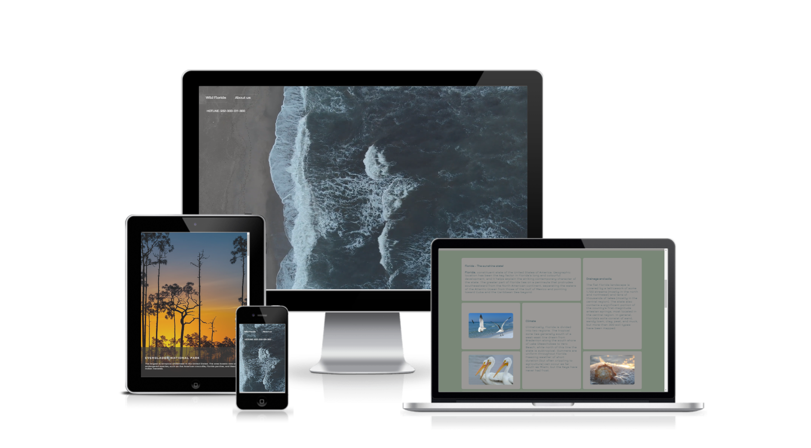

<h1><em><a href="https://wild-florida-mvstoyan.netlify.app" target="_blank">Wild Florida website</a><em></h1>
    

  <h3>Features:</h3>
  
My first educational project about the flora and fauna of Florida, its endangered animals and birds, and the people who work tirelessly to preserve its beauty and wildlife.

    <ul>
      <li>Responsive, on all devices</li>
   </ul>

  <h3>Technologies Used</h3>
   <ul>
      <li><a href="https://www.w3schools.com/html/" target="_blank">HTML</a></li>
      <li><a href="https://www.w3schools.com/css/" target="_blank">CSS</a></li>
        <ul>
          <li><a href="https://medium.com/@andybarefoot/a-masonry-style-layout-using-css-grid-8c663d355ebb" target="_blank">Masonry style layout with CSS Grid<li>
      <li><a href="w3schools.com/css/css3_animations.asp" target="_blank">CSS Animations<a><li>
        </ul>
   </ul>

  <h3>Website Demo</h3>

